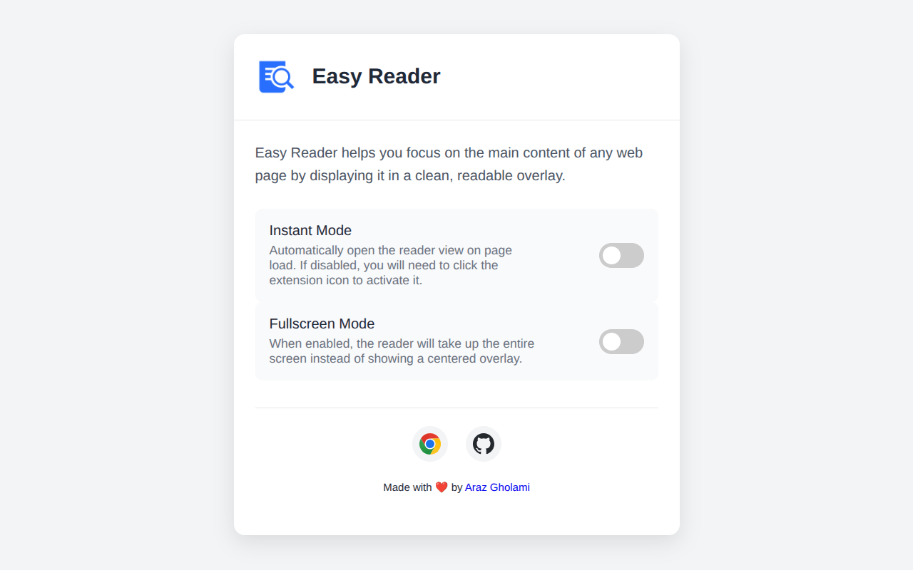

# 📚 Easy Reader

A Chrome extension that enhances your reading experience by providing a clean, distraction-free overlay for article content with automatic RTL/LTR text direction detection.

## ✨ Features

- **Clean Reading Experience**: Focus on content without distractions
- **Automatic Text Direction**: Smart detection of RTL (Right-to-Left) and LTR (Left-to-Right) content
- **Customizable Display**: Adjust text size and appearance through options
- **Instant Mode**: Automatically load articles in reader view
- **Keyboard Shortcuts**: Quick access to toggle the reader view
- **Responsive Design**: Works seamlessly across different screen sizes

## 🚀 Installation

From Chrome Web Store: [Chrome WebStore](https://chromewebstore.google.com/detail/easy-reader/fijalbmgmpfidhhffjngcndldicejbbk)

Manual:
1. Clone this repository or download the source code
2. Open Chrome and navigate to `chrome://extensions/`
3. Enable "Developer mode" in the top-right corner
4. Click "Load unpacked" and select the extension directory
5. Pin the extension to your toolbar for easy access

## 🛠️ Usage

- Click the Easy Reader extension icon to activate the reader view on any article
- Use the close button or press `Escape` to exit reader view
- Customize your reading experience in the extension options

## ⚙️ Options

Access the options by right-clicking the extension icon and selecting "Options". Here you can:
- Toggle Instant Mode
- Adjust text size and font
- Customize the color scheme

## 📝 License

This project is licensed under the MIT License - see the [LICENSE](LICENSE) file for details.

## 🤝 Contributing

Contributions are welcome! Please feel free to submit a Pull Request.
